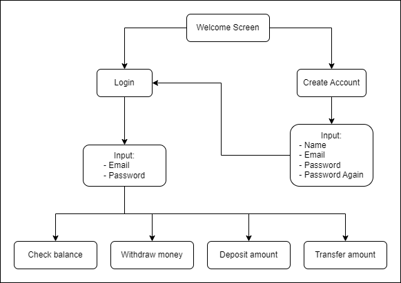

# Banking App Simulation CLI
[](https://golang.org/)

## About
---
This is simulation of simple banking application program with Command Line Interface (CLI)
### Features
```
- Create Account
- Login
- Check balance
- Withdraw
- Deposit
- Transfer
```

## Quick Start
---
```
# Run App
go run .
```

## Project Diagram
---

